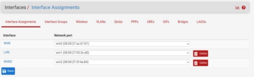
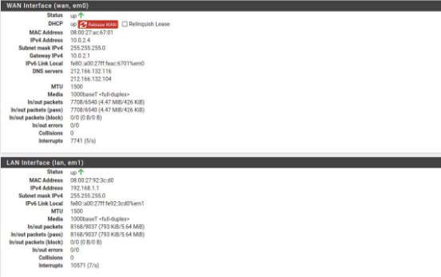
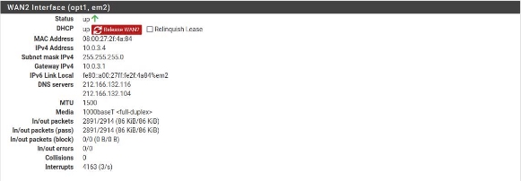
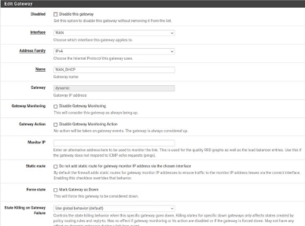
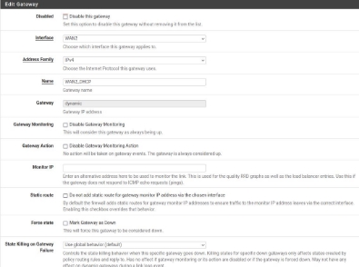
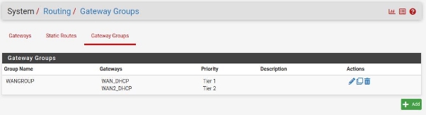
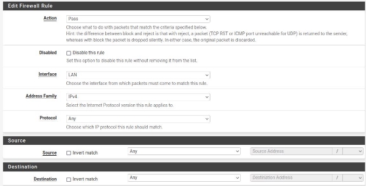
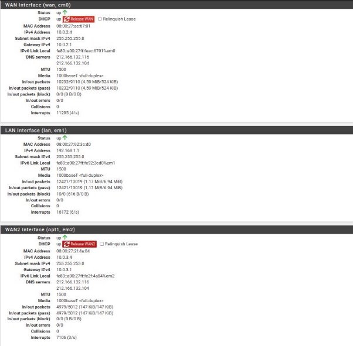
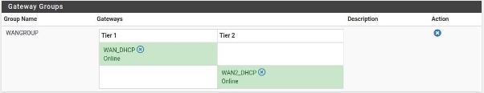
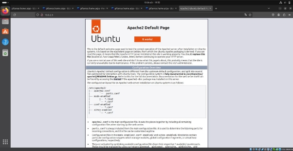

Marcos Cáceres García

Diseño general de alta disponibilidad WAN en pfSense

Índice

1. [**Escenario............................................................................................................................3**](#_page2_x72.00_y72.00)
1. [**Configuración.....................................................................................................................3**](#_page2_x72.00_y206.27)
1. [Interfaces.....................................................................................................................3](#_page2_x72.00_y258.72)
1. [Gateway.....................................................................................................................4](#_page3_x72.00_y229.61)
1. [Firewall........................................................................................................................6](#_page5_x72.00_y72.00)
3. [**Comprobaciones................................................................................................................7**](#_page6_x72.00_y72.00)

1.Escenario.

Para el escenario he usado VirtualBox y he creado tres máquinas virtuales, una de ellas es un cortafuegos PfSense, al cual le he configurado 3 tarjetas de red, una WAN con la red 10.0.2.0/24, otra WAN con la red 10.0.3.0/24 y otra con la red interna de PfSense con la 192.168.1.0//24; he creado una máquina virtual con Ubuntu la cual hará de estudiante en una clase de informática y se situará en la red interna, también se ha creado otra máquina Ubuntu que actuará de servidor externo como podría ser cualquier página web y se sitúa de una WAN, tiene instalado apache por el simple hecho de hacer pruebas.

2.Configuración.

1. Interfaces

Comenzando la configuración lo primero que debemos hacer es asignar a cada una de las interfaces una conexión, Para ello vamos a Interfaces à assign y configuramos la conexiones WAN1, WAN2 y LAN. Es decir

definimos que placa se va a conectar a qué servicio:

Una vez hecho esto debemos de asignar a cada interfaz una dirección IP:

2. Gateway

Para que los alumnos puedan tener salida a internet se le debe de configurar un gateway a cada interfaz WAN que hayamos creado, para ello vamos a System > Routing y ahí agregamos nuestras interfaces:

El siguiente paso es definir un Grupo de Gateway que en una misma conexión contará con nuestros dos Gateway provistos por nuestros ISP y se encargará de proveernos la salida a internet.

Para ello vamos a Systems > Gateway > Groups:

Ahora bien, llegados a este punto debemos de configurar el grupo de gateway, debemos de asignar a cada gateway un tier, esto nos servirá para darle prioridad a cierto gateway y de esta manera permitir que la red se regule en caso de un exceso de carga:

Una vez hecho esto podemos continuar a agregar una regla para el firewall.

3. Firewall

Debemos de configurar una regla para la LAN que haga que todos los paquetes provenientes de la LAN circulen por el WANGROUP que acabamos de crear, para ello nos disponemos a Firewall > Rules y creamos la siguiente regla:

De esta manera los alumnos ya podrán tener acceso a internet.

3.Comprobaciones.

A continuación muestro una serie de capturas del Status tanto de las interfaces como de los gateway:

Y aquí podemos ver la página del servidor externo:

8
