Diseño general de pfSense sobre 

Proxmox 

Índice 

1. Instalación pfSense .................................................................................................................... 3 
1. Configuración Firewall ............................................................................................................... 3 
1. Instalación HAProxy ................................................................................................................... 3 
1. Backend .............................................................................................................................. 4 
1. Frontend ............................................................................................................................. 5 
4. Redirección puerto pfSense ...................................................................................................... 5 
1. Instalación pfSense 

La instalación que seguiremos es la común, solo que añadiremos la interfaz OPT para poder acceder al servidor de máquinas virtuales. 

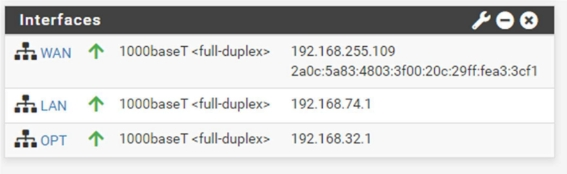

2. Configuración Firewall 

Para que las máquinas puedan acceder a internet para actualización de paquetes permitimos el tráfico en las interfaces LAN y OPT, cuando queramos securizar se cambiarán las reglas. 

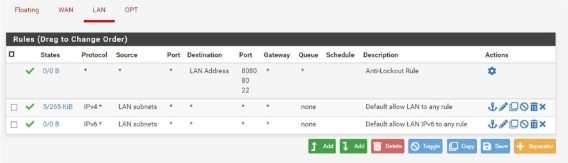

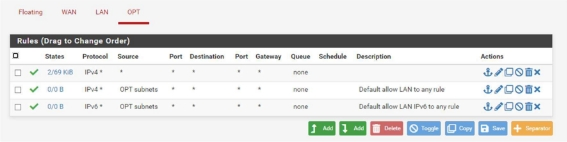

3. Instalación HAProxy 

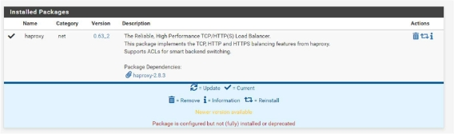

Activamos el paquete y establecemos un número máximo de conexiones. 

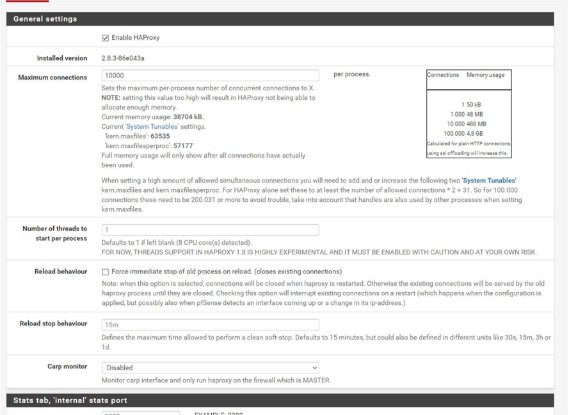

1. Backend 

Creamos un nuevo backend que apunte al servidor de MVs, con IP 192.168.32.5. 

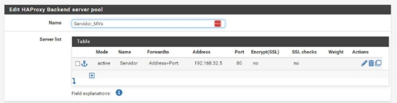

Establecemos un nombre a la pool de servers, el nombre del servidor en modo activo, la dirección y puerto. 

2. Frontend 

Creamos el frontend, que apuntará a la interfaz WAN por el puerto 80. 

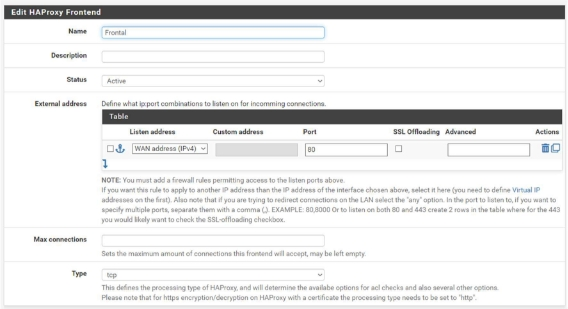

Importante seleccionar el tipo de frontend, en este caso tcp, ya que si no, no funcionará. Y en acciones, elegir USE BACKEND, y seleccionamos el servidor backend.  

4. Redirección puerto pfSense 

Para la redirección de puertos basta con acceder al apartado port forward en la configuración NAT, en firewall. 

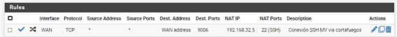

En este caso he configurado la regla para que desde el puerto 9006 de la WAN acceda al 22 de la máquina de red de MVs. 

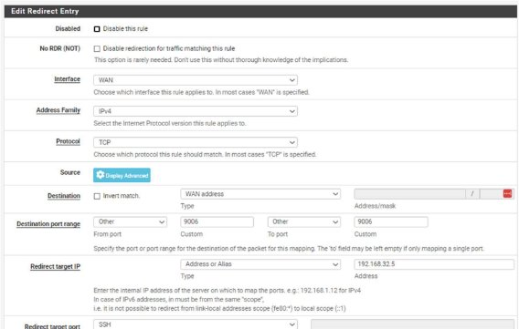

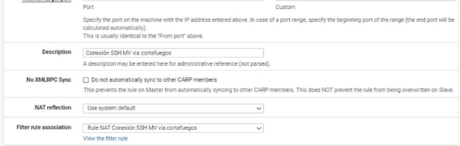

Si hacemos un ssh al puerto 9006 del pfsense, nos abrirá el acceso: 

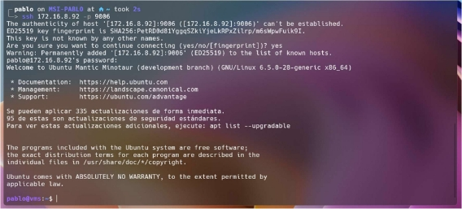
