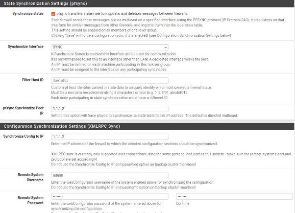
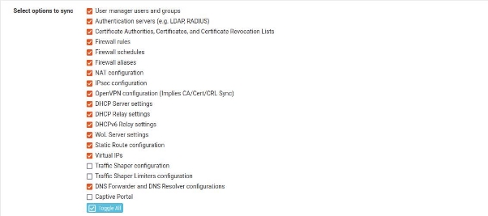
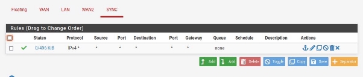
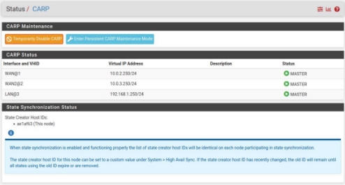
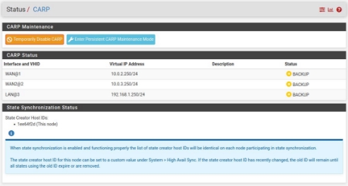

[Marcos Cáceres García](mailto:a22cagama@iesgrancapitan.org)

Alta disponibilidad con PfSense.

Índice

1. [**Escenario. 3**](#_page2_x72.00_y72.00)
1. [**Configuración. 3**](#_page2_x72.00_y162.63)
1. [Interfaces. 3](#_page2_x72.00_y215.08)
1. [Modo CARP. 4](#_page3_x72.00_y72.00)
1. [Reglas. 5](#_page4_x72.00_y72.00)
3. [**Comprobaciones. 5**](#_page4_x72.00_y229.98)

1.Escenario.

En este escenario tenemos dos máquinas virtuales con PfSense, ambas máquinas cuentan con 4 interfaces de red, una de ella es la WAN1 la otra es la WAN2 la otra es la LAN y por último es la SYNC que sirve para sincronizar ambos PfSense.

Contamos con una máquina virtual con Ubuntu que se encontrará en la LAN.

2.Configuración.

1. Interfaces.

Para las interfaces hemos añadido simplemente una interfaz más a las interfaces que ya teníamos en el diseño de PfSense, debemos de añadir una interfaz de sincronización para la transmisión de información entre ambos PfSense, para ello vamos a asignar la interfaz a la tarjeta de red:

En el caso de PfSense Master la ip es 1.1.1.1 y en el caso del Slave es 1.1.1.2.

También debemos de añadir 3 interfaces virtuales, una para la WAN1, para la WAN2 y para la LAN:

Dichas interfaces han de ser iguales y con las mismas IPs en ambos PfSense.

Al tener dichas IP activas digamos que ya podemos empezar a configurar el modo CARP, que sirve para compartir una serie de IP predeterminadas.

2. Modo CARP.

El modo CARP nos permite “enlazar” ambos PfSense y de esta manera permite sincronizar los cambios en ambos PfSense.

Debemos situarnos en la sección de System > High Availability:

Aquí debemos de poner la IP del PfSense esclavo (esta configuración solo se hace en el PfSense Master) para su sincronización, al igual que el nombre y la contraseña del usuario PfSense Slave, en mi caso es Admin, también debemos de seleccionar qué cosas se van a sincronizar:

3. Reglas.

Para que ambos cortafuegos tengan contacto entre ellos debemos de añadir una regla para la interfaz SYNC que permite todo el tráfico:

3.Comprobaciones.

Para las comprobaciones podemos ir a la sección de Status > CARP y veremos lo siguiente:

Eso en el Master.

Y esto en el Slave.

Otra manera de comprobar que funciona bien es añadir una regla al cortafuegos Master y ver que se crea en el Slave:

[ubuntu \[Corriendo\] - Oracle VM VirtualBox 2024-04-25 14-17-15.mp4](https://drive.google.com/file/d/1rkVaKcoslwRDmcD0cL9KngTsMbSaKwhX/view?usp=sharing)
6
