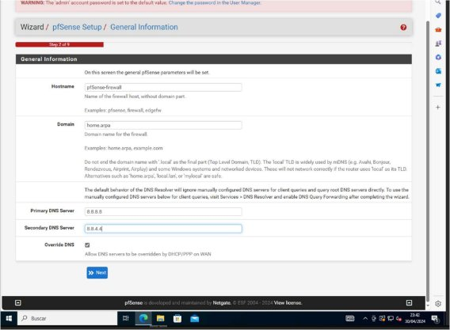
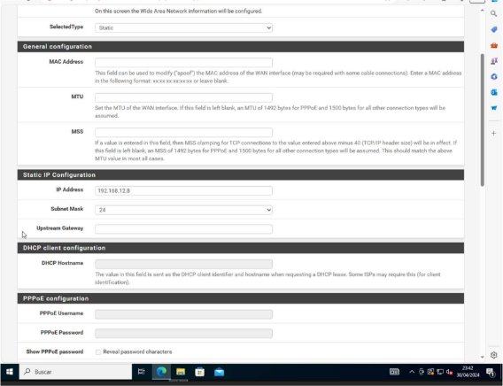
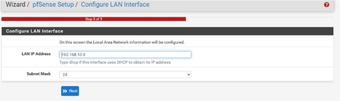

Instalación básica pfSense 

Índice 

1. Instalación pfSense .................................................................................................................... 3 
1. Configuración IP cliente ............................................................................................................. 4 
1. Instalación pfSense 

Para la configuración durante la instalación, asigno la IP 192.168.12.8/24 a la interfaz WAN (vtnet1) y la 192.168.10.8 a la interfaz LAN (vtnet0). Los servidores DNS se asignan desde la web. 

2. Configuración IP cliente 

Para poder conectarme desde la web tengo que cambiar la configuración IP del cliente, y le he asignado la IP 192.168.10.10/24 con Gateway 192.168.10.8, para que todo el trafico de este pase por el cortafuegos. 
