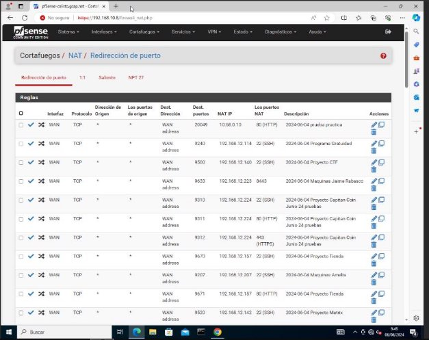
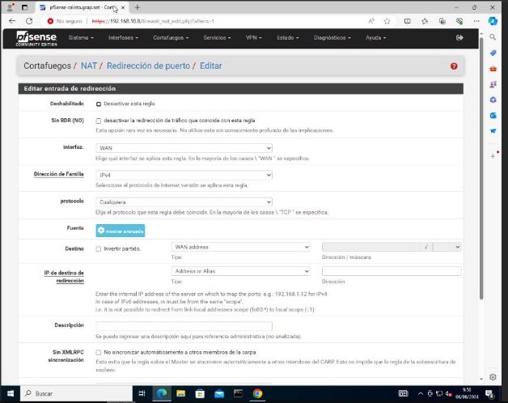
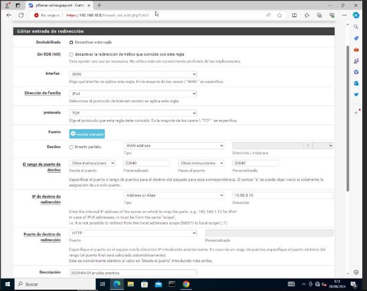
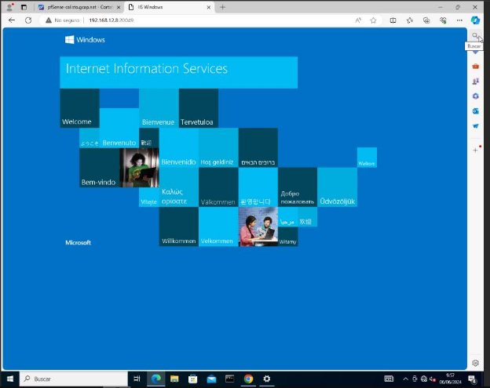
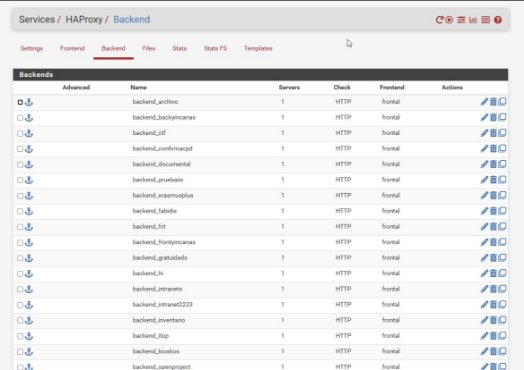
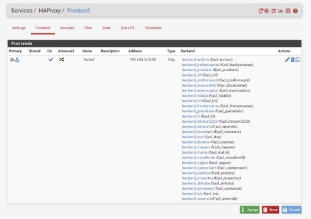

Marcos Cáceres García Pablo Valencia Palomino

Migración Proxy y DNAT en Cortafuegos

1. [**Reglas DNAT 3**](#_page2_x72.00_y72.00)
1. [**Proxy 7**](#_page6_x72.00_y72.00)

1.Reglas DNAT

Para las reglas de DNAT hemos seguido la tabla que creamos la semana pasada en la cual dividimos las máquinas de luna y de calisto con reglas y sin reglas, una vez hecho esto nos dirigimos a la sección de cortafuegos y a NAT:

Una vez aquí debemos de añadir las reglas según nuestra tabla, para ello debemos de seleccionar en Añadir Regla:

Una vez en la pantalla de selección de reglas debemos de seleccionar la interfaz a la interfaz que va a afectar, en este caso a la WAN (192.168.12.X/24), una vez hecho esto debemos de seleccionar el rango de puertos de origen, como en las reglas los puertos son exactos, es decir, no son un rango, debemos de poner el mismo puerto en los dos apartados, una vez hecho esto debemos de escribir la IP de la máquina de a red interna VM, en nuestro caso hemos clonado la máquina de pruebas de windows y le hemos instalado IIS y la hemos añadido a la red de VM con la IP 10.68.0.10, una vez hecho esto, debemos de seleccionar el puerto de destino, que normalmente suele ser el puerto 80 o 22:

Para comprobar que funciona, debemos de poner la IP de la interfaz WAN del cortafuegos seguido del puerto que hayamos escrito en la regla (20049) y si la regla funciona bién deberíamos ver la página IIS de la máquina windows en la red de VM, ahora debemos repetir el proceso con todas las reglas de la tabla de reglas:

6

Marcos Cáceres García Pablo Valencia Palomino

2.Proxy

Para la configuración Proxy, hemos elegido la herramienta HAProxy, ya que ofrece la mejor estabilidad y eficiencia en el procesamiento de tráfico para pfSense, además de protegerlo contra ataques DDoS, entre otros.

La configuración del proxy consta de 2 bloques: backend y frontend. Se ha creado un backend por cada sitio configurado en nginx en la antigua arquitectura del sistema, y un frontend para todos los backend, con las ACLs correspondientes para cada sitio.

Los sitios creados son:

- archivo.iesgrancapitan.org
- backyincanas.iesgrancapitan.org
- ctf.iesgrancapitan.org
- confirmacpd.iesgrancapitan.org
- documental.iesgrancapitan.org
- erasmusplus.iesgrancapitan.org
- fabidis.iesgrancapitan.org
- fct.iesgrancapitan.org
- frontyincanas.iesgrancapitan.org
- gratuidads.iesgrancapitan.org
- hi.iesgrancapitan.org
- intranets.iesgrancapitan.org
- intranet2223.iesgrancapitan.org
- inventario.iesgrancapitan.org
- itop.iesgrancapitan.org
- kioskos.iesgrancapitan.org
- openprojects.iesgrancapitan.org
- moodle-old.iesgrancapitan.org
- pedidos.iesgrancapitan.org
- shikoba.iesgrancapitan.org
- proyectos.iesgrancapitan.org
- sysmanas.iesgrancapitan.org
- tvs.iesgrancapitan.org
- www-old.iesgrancapitan.org
- matrix.iesgrancapitan.org
- nagios.iesgrancapitan.org

7
Marcos Cáceres García Pablo Valencia Palomino

8
