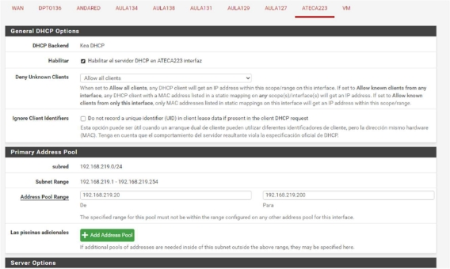
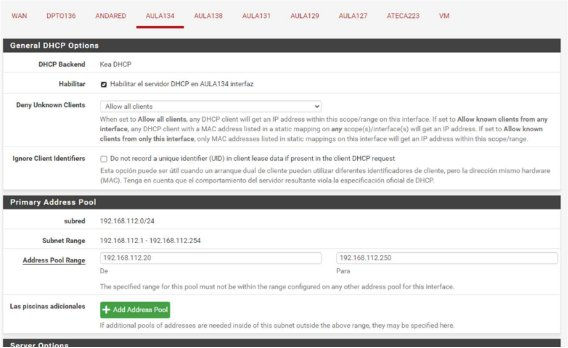
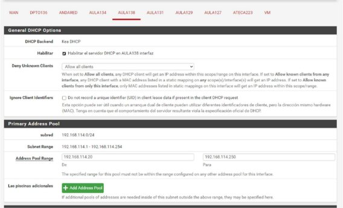
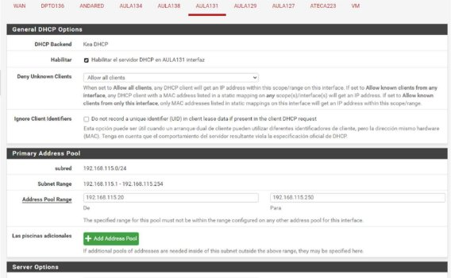
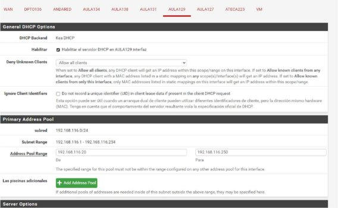
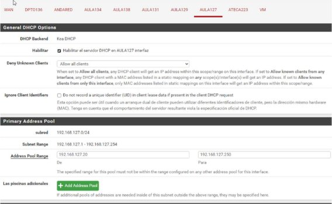
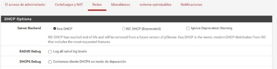

Activación del servico DHCP en el resto 

de redes LAN en pfSense 

Índice 

1. Ac  vación DHCP en cada VLAN ................................................................................................. 3 
1. VLAN 219. ATECA223 .......................................................................................................... 3 
1. VLAN 112. Nombre interfaz AULA134 y dirección 192.168.112.8/24 ................................ 3 
1. VLAN 114. Nombre interfaz AULA138 y dirección 192.168.114.8/24 ................................ 4 
1. VLAN 115. Nombre interfaz AULA131 y dirección 192.168.115.8/24 ................................ 4 
1. VLAN 116. Nombre interfaz AULA129 y dirección 192.168.116.8/24 ................................ 5 
1. VLAN 127. Nombre interfaz AULA127 y dirección 192.168.127.8/24 ................................ 5 
2. Servicio Kea DHCP ..................................................................................................................... 6 
1. Ac  vación DHCP en cada VLAN 
1. VLAN 219. ATECA223 

2. VLAN 112. Nombre interfaz AULA134 y dirección 192.168.112.8/24 

3. VLAN 114. Nombre interfaz AULA138 y dirección 192.168.114.8/24 

4. VLAN 115. Nombre interfaz AULA131 y dirección 192.168.115.8/24 

5. VLAN 116. Nombre interfaz AULA129 y dirección 192.168.116.8/24 

6. VLAN 127. Nombre interfaz AULA127 y dirección 192.168.127.8/24 

2. Servicio Kea DHCP 

pfSense lanzaba una alerta de que el servicio DHCP estaba sin soporte, y me recomendaba ac  var el servicio DHCP por Kea. 

