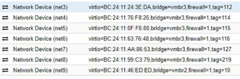
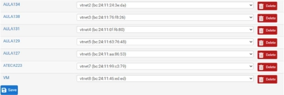
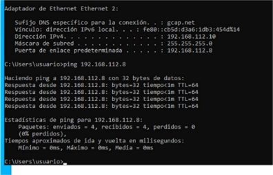
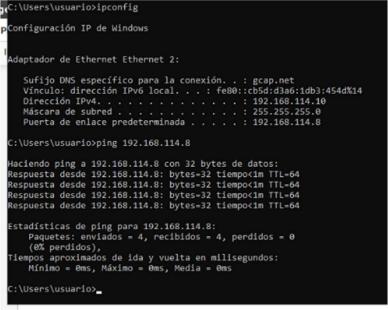
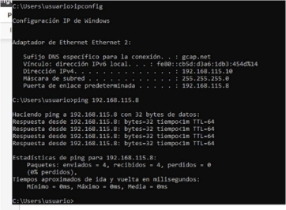
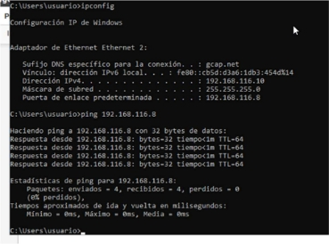
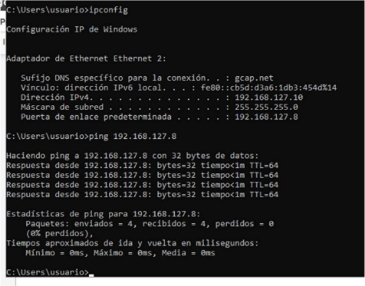
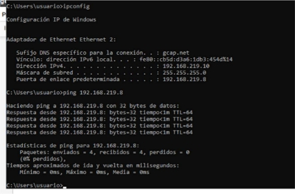

Implementación del resto de redes LAN 

en pfSense 

Índice 

1. VLANes a asignar ....................................................................................................................... 3 
1. Interfaces asignadas .................................................................................................................. 3 
1. Comprobaciones ....................................................................................................................... 3 
1. VLAN 112 ............................................................................................................................ 3 
1. VLAN 114 ............................................................................................................................ 4 
1. VLAN 115 ............................................................................................................................ 4 

3\.3. VLAN 116 ............................................................................................................................ 5 

3\.3. VLAN 127 ............................................................................................................................ 5 

3\.3. VLAN 219 ............................................................................................................................ 5 

3\.3. VLAN 10 .............................................................................................................................. 6 

4. Firewall ...................................................................................................................................... 6 

1. VLANes a asignar 
- VLAN 112. Nombre interfaz AULA134 y dirección 192.168.112.8/24 
- VLAN 114. Nombre interfaz AULA138 y dirección 192.168.114.8/24 
- VLAN 115. Nombre interfaz AULA131 y dirección 192.168.115.8/24 
- VLAN 116. Nombre interfaz AULA129 y dirección 192.168.116.8/24 
- VLAN 127. Nombre interfaz AULA127 y dirección 192.168.127.8/24 
- VLAN 219. Nombre interfaz ATECA223 y dirección 192.168.219.8/24 
- VLAN 10. Nombre interfaz MV y dirección 10.0.0.8/8 

Las siguientes redes se asignaron a las interfaces respectivamente: 

2. Interfaces asignadas 

Se asignaron en orden. 

3. Comprobaciones 

3\.1. VLAN 112 

2. VLAN 114 

3\.3. VLAN 115 

3. VLAN 116 

3\.3. VLAN 127 

3\.3. VLAN 219 

3. VLAN 10 

4. Firewall 

He  añadido  una  regla  a  cada  interfaz  para  permitir  todo  el tráfico,  por  lo  que  habrá  que eliminarlas cuando se terminen las pruebas. 
