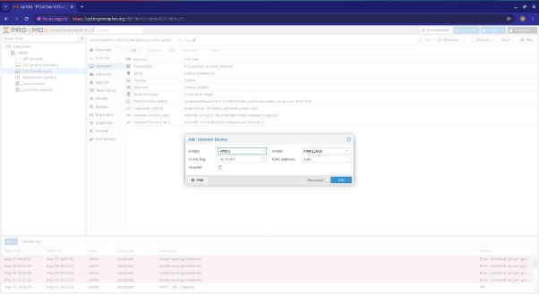
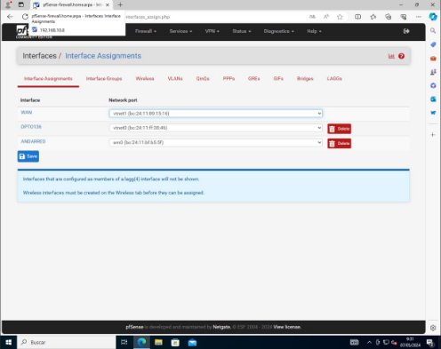
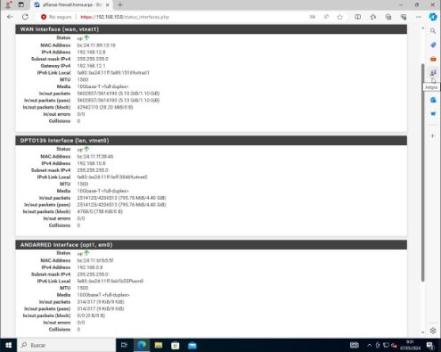
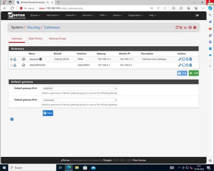
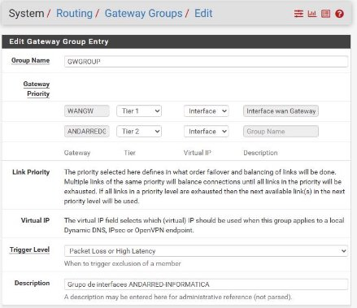
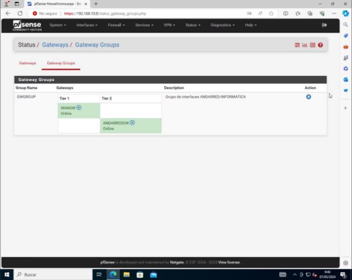
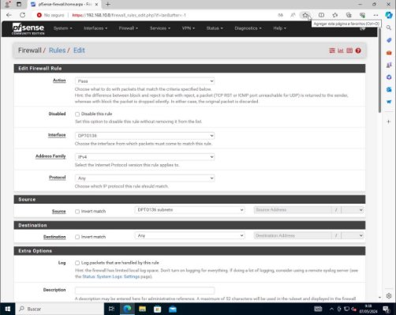
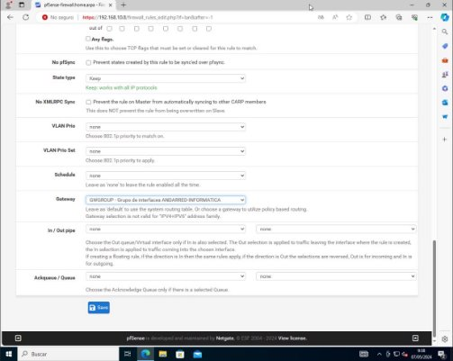
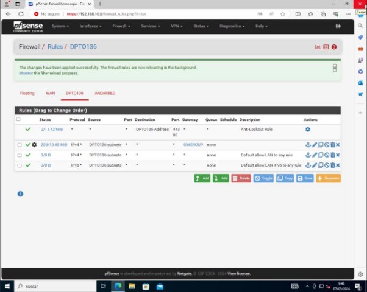

Marcos Cáceres García

Implementación de alta disponibilidad WAN en calisto

Índice

1. [**Añadimos la NIC.................................................................................................................3**](#_page2_x72.00_y72.00)
1. [**Configuración de interfaz..................................................................................................4**](#_page3_x72.00_y72.00)
1. [**Creación de los Gateway...................................................................................................5**](#_page4_x72.00_y72.00)
1. [**Creación de reglas firewall................................................................................................7**](#_page6_x72.00_y72.00)

1.Añadimos la NIC

Para añadir nuestra tarjeta de red debemos situarnos en la pestaña de hardware y seleccionamos añadir:

Seleccionamos Network Device y una vez allí seleccionamos en el desplegable la NIC que queremo añadir, en mi caso la de Andared:

Una vez añadida la NIC ya podemos disponernos a entrar en nuestro firewall y configurar dicha interfaz.

2.Configuración de interfaz.

Al igual que ocurre con el laboratorio que monté, debemos de asignar las interfaces a las NIC, así que nos disponemos en interfaces > assigment y quedarán de la siguiente manera:

La interfaz queda configurada con la IP, DNS y gateway necesarios según se me pide en mi paquete de trabajo:

3.Creación de los Gateway.

Ahora debemos de crear una Gateway nueva para nuestra interfaz ANDARED, para ello nos situamos en System > Routing > Gateway, y ahí creamos las Gateway según se pide en el paquete de trabajo:

Una vez creadas las interfaces debemos de configurar el grupo de gateway, dicho grupo nos servirá más tarde para configurar el balanceo de carga entre ambas interfaces la de informática y la de andared, para ello vamos a gateway groups y establecemos la siguiente configuración:

4.Creación de reglas firewall.

Ahora debemos de crear las reglas que obligarán a al tráfico de la LAN a circular por el grupo de gateway, para ello nos disponemos a firewall > rules y creamos la siguiente regla:

Como se puede ver hace que todo el tráfico saliente de la LAN sea obligado a circular por el grupo de gateway.

Quedando de la siguiente manera, es importante ponerla la primera de todas ya que las reglas están ordenadas por orden de prioridad:

8
